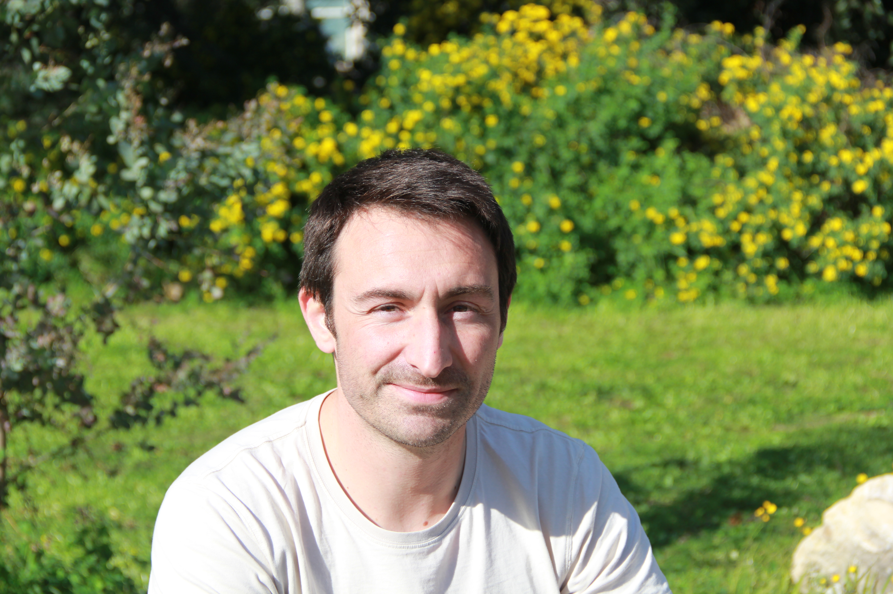

```{=html}
<section class="home-hero" aria-labelledby="home-name">
  <div>
    <p class="eyebrow">Evolutionary ecotoxicology & ecophysiology</p>
    <h1 id="home-name">Quentin <span>Petitjean.</span></h1>
    <p class="intro">Understanding how animals respond to a changing environment.</p>
    <p>I study how pollution, temperature and pathogens interact and why some individuals and populations cope better than others.</p>
    <p class="hero-role">Research scientist · INRAE<br>Bees & Environment · Avignon, France</p>
    <div class="link-row"><a class="button-link" href="research.html">Explore my research ↗</a><a class="text-link" href="publications.html">Publications</a><a class="text-link" href="mailto:quentin.petitjean@inrae.fr">Get in touch</a></div>
  </div>
  <figure class="hero-photo"><figcaption>Ecology. Individual variation. Open science.</figcaption></figure>
</section>

<section class="home-section" aria-labelledby="themes-title">
  <div class="section-heading"><h2 id="themes-title">One environment. Different responses.</h2><a class="text-link" href="research.html">Research themes ↗</a></div>
  <div class="theme-grid">
    <article><span class="theme-number">01 / MULTIPLE STRESSORS</span><h3><a href="research.html#multiple-stressors">Combined effects of environmental stressors</a></h3><p>Understanding how contaminants, temperature and pathogens interact to affect organisms, from molecular responses to behaviour and survival.</p></article>
    <article><span class="theme-number">02 / INDIVIDUAL VARIATION</span><h3><a href="research.html#variation">How and Why individuals differ in their sensitivity</a></h3><p>Investigating how sensitivity to environmental stress varies within and among populations, and the physiological and behavioural factors underlying these differences.</p></article>
    <article><span class="theme-number">03 / WILD POLLINATORS</span><h3><a href="research.html#pollinators">Wild bee diversity, health and pollination</a></h3><p>Assessing how pesticides and their alternatives affect the health of different wild bee species, with consequences for bee diversity and pollination.</p></article>
  </div>
</section>

<section class="home-section" aria-labelledby="work-title">
  <div class="section-heading"><h2 id="work-title">Selected work</h2><a class="text-link" href="publications.html">All publications ↗</a></div>
  <div class="feature-work">
    <article><span class="eyebrow">Research software</span><h3>From animal movement<br>to biological insight.</h3><p>MoveR brings importing, cleaning, visualising and analysing animal video-tracking data into one flexible R workflow.</p><a class="text-link" href="open-science.html#mover">Discover MoveR ↗</a></article>
    <article><span class="eyebrow">Evolutionary ecotoxicology</span><h3>Responses to pollution<br>depend on the population.</h3><p>A field experiment in fish explores adaptive and plastic responses to metal contamination in a context of multiple stressors.</p><a class="text-link" href="https://doi.org/10.1007/s11356-023-26189-w">Read the study ↗</a></article>
  </div>
</section>
```





```{=html}
<section class="contact-band" aria-labelledby="contact-title"><div><h2 id="contact-title">Get in touch.</h2><p>Research, open science, or a question about MoveR.</p></div><a class="button-link" href="about.html#contact">Contact & profiles ↗</a></section>
```

