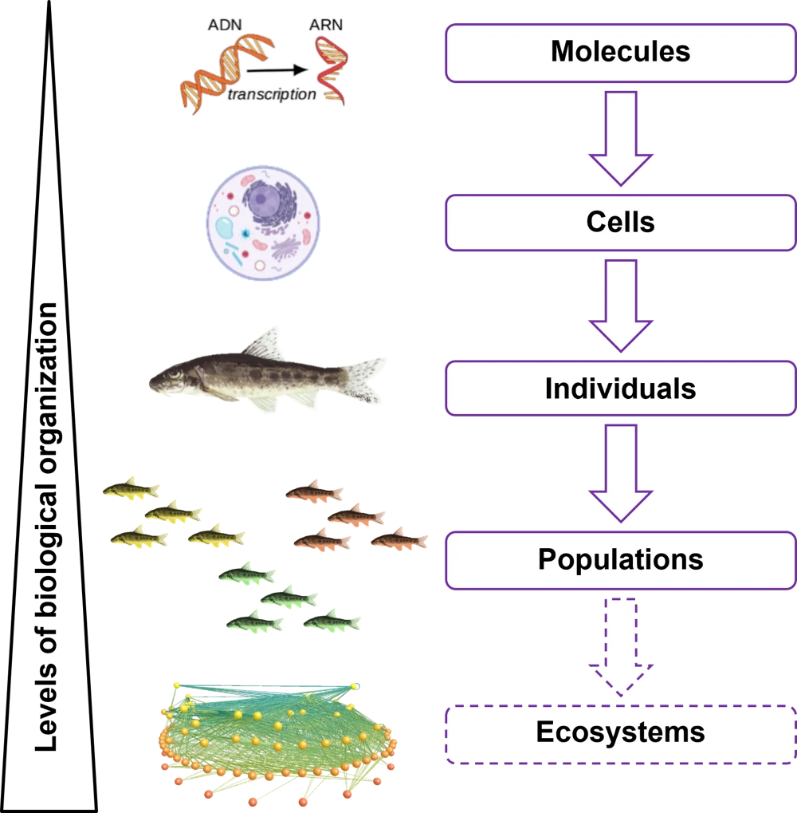

I investigate how organisms respond to global environmental change. My work connects ecotoxicology, ecophysiology, and evolutionary ecology, using fish, insects, and other organisms to understand responses to multiple stressors.

## Combined effects of environmental stressors {#multiple-stressors}

In the wild, organisms often face many different stressors at once. Contamination, for instance, can co-occur and interact with temperature changes and pathogens leading to unexpected effects that differ from those of each stressor acting alone. I investigate these combined effects across levels of biological organisation, linking molecular and cellular responses to changes in physiology, behaviour, growth and survival.

My research combines field observations, reciprocal transplants and controlled experiments to link patterns observed in natural environments with the mechanisms underlying responses to environmental stress.

{.research-figure fig-alt="Diagram connecting molecular, cellular, individual and population levels of biological organisation"}

## How and why individuals differ in their sensitivity {#variation}

Individuals exposed to the same environmental stressors do not necessarily respond in the same way. I investigate how sensitivity varies within and among populations, and the physiological and behavioural traits underlying these differences.

I am particularly interested in how behaviour, physiological condition and exposure history influence responses to stress, including the capacity to adjust through plasticity. Understanding this variation can help explain why some individuals cope better than others and improve predictions of environmental impacts on populations.

## Wild bee diversity, health and pollination {#pollinators}

Since January 2025, I have been a research scientist in the [Bees & Environment unit at INRAE](https://abeilles-et-environnement.paca.hub.inrae.fr/) in Avignon. My current work investigates how pesticides and their alternatives affect wild bee health, and the consequences for bee diversity and pollination. \

Wild bees encompass species with diverse life histories, physiologies and behaviours, which can influence both their exposure and their sensitivity to environmental stressors. By studying these differences, I aim to better understand and predict effects across species and link changes in bee physiology and behaviour with their ability to pollinate plants.

I also co-coordinate the Pesticides & Pollinators Group within the [POLLINECO network](https://pollineco.org/).

## Research in practice

- **Ecotoxicology:** laboratory and field experiments, including reciprocal transplants to understand effect of contaminants on organisms.
- **Integrative biology:** connecting physiology, behaviour, microbiota and organism performance.
- **Quantitative methods:** reproducible analyses and tools for animal video-tracking data.
- **Open science:** sharing data, code and practical resources to support reliable research.

[Publications](publications.qmd) · [Talks & posters](communications.qmd) · [Career and project details](cv.qmd) · [Get in touch](about.qmd#contact)
